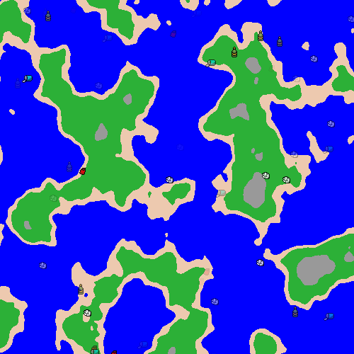

# Throw Trash in the Ocean

WIP multiplayer ocean trashing simulation

Made for my DCC Capstone

## Setup and Run

### Deploy locally
    npm install -g nodemon
    cd backend && nodemon server.js

	cd client && npm start

### Deploy with Docker Compose
	docker-compose up --build