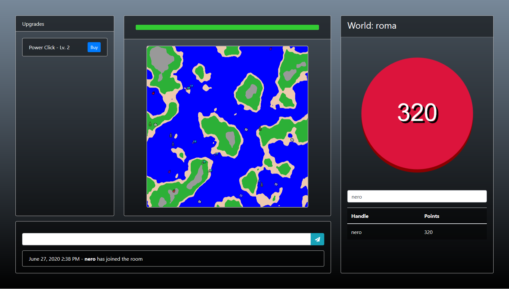

# Throw Trash in the Ocean

Multiplayer ocean-trashing simulation made for my DCC Capstone.

## How it Works

Throw Trash in the Ocean is a web simulation that lets you join and pollute a
shared world with others. You can make money in your world by pressing
a button in exchange for producing trash. Trash hurts your world's
health. If a world's health reaches zero, it gets destroyed.
Although one player cannot single-handedly destroy a world, enough players all polluting at
the same time have the potential to. Your goal: make lots of money for yourself without
collectively destroying the world with the peers you share it with.

## Setup and Run

### Deploy locally

    # Backend
    cd backend
    yarn install
    npm install -g nodemon
    nodemon server.js

    # Frontend
    cd client
    yarn install
    yarn start

### Deploy with Docker Compose

	docker-compose up --build